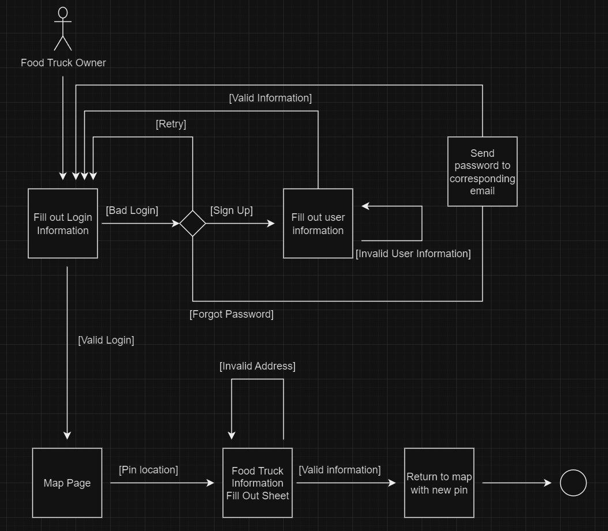

# Specification Phase Exercise

A little exercise to get started with the specification phase of the software development lifecycle. See the [instructions](instructions.md) for more detail.

## Team members
1. (Ryan Horng)[https://github.com/Ryan-Horng]
2. (Kei Oshima)[https://github.com/KeiOshima]
3. (Andrew Huang)[https://github.com/andrew0022]
4. (Richard Qu)[https://github.com/kingslayerrq]

## Stakeholders
1. Derrik: Derrik is a current NYU student in the history department's accelerated master's program and a visiting student at Columbia University. This leads to him constantly traveling around the city and being busy with research, going to conferences, and doing his school work, so he often has little time to go home to eat or go to a restaurant to eat. So, this mainly leads to him going to food trucks to eat food. 

    goals/needs:
    1. Since he is still a college student who wants to save as much money as possible, he wants to see the price ranges of food carts. 
    2. Since he is constantly traveling around the city, he would like to know where nearby food trucks are based on his location.  
    3. If he finds a food cart he lies and frequents, he would like to know when they would be there and if they moved to a different location. 

    problems/frustation:
    1. Since Derrik is a vegan, he has no way of knowing if a food cart has adequate options for him until he goes to the actual food cart
    2. Since Derrik's diet is very restrictive, he is limited to the type of cuisine he can eat. Thus, he finds it frustrating that he only knows whether or not he can eat at that food car once he determines if the cuisine they cook matches his dietary preference.
    3. Since Derrik is constantly busy with his studies, so he doesn't have the time to look for food carts in the area, which can lead to skipping meals if he can't find one within the limited free time he has.

## Product Vision Statement

The app is made to allow users to track and filter search food trucks in New York City, using locations found by users tracking and pinning food trucks.

## User Requirements

1. As a vegan, I want to be able to find food trucks with vegan option so that i can enjoy a meal that fits my dietary restrictions
2. As a broke college student i want to be able to explore the cost of food trucks so that i can save money while enjoying a tasty meal
3. As a foodie, I want to be able to see the type of cuisine a food truck has, so that i can decided whether or not i would want to eat the food at the food truck.
4. As a foodie, I want to be able to see the number of food trucks around me, so that I can grab a quick bite to eat.
5. As a food delivery guy, I want to find specific food trucks so I can fulfill delivery requests.
6. As a regular for a particular food truck, I want to know where and when this food truck is available, so I can go out and eat at them.
7. As a food truck owner, I want to pin my location on the app, so I can promote my business to those who want to find my food truck.
8. As a food truck owner, I want to check where it isn’t crowded with food trucks, so I can avoid competition for my business.
9. As a critic who likes to review food, I want to know popular spots for food trucks, so I can taste test as many as possible for my blog.
10. As a religious person looking for a bite to eat, I want to know the ingredients being used in the food truck, so I can make sure I am following my diet.

## Activity Diagrams

As a food truck owner, I want to pin my location on the app, so I can promote my business to those who want to find my food truck.

## Clickable Prototype

See instructions. Delete this line and place a publicly-accessible link to your clickable prototype here.
